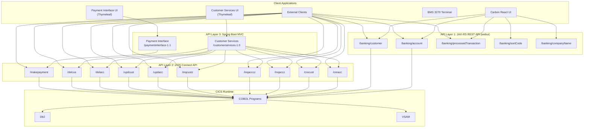
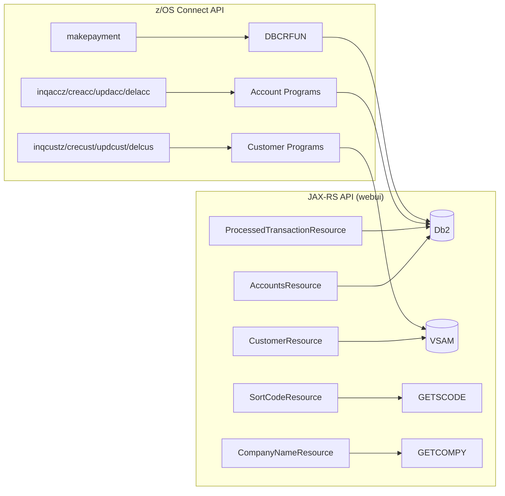

# API Definitions and Documentation

This document provides a comprehensive reference for all API endpoints in the CBSA workspace, covering three distinct API layers: JAX-RS REST API (webui), z/OS Connect API, and Spring Boot web interfaces.

## API Architecture Overview



---

## 1. JAX-RS REST API (webui module)

**Runtime**: CICS Liberty JVM Server (CBSAWLP)  
**Base Path**: `/banking` (defined by `@ApplicationPath("banking")` in `BankingApplication`)  
**Full Context**: `/webui-1.0/banking/*`  
**Content Type**: `application/json`  
**Security**: No authentication/authorization enforced at API level  
**Source**: `src/webui/src/main/java/com/ibm/cics/cip/bankliberty/api/json/`

### 1.1 Account Resource — `/banking/account`

**Class**: `AccountsResource` — [source](../../src/webui/src/main/java/com/ibm/cics/cip/bankliberty/api/json/AccountsResource.java)

| # | Method | Path | Method Name | Request | Response | Status Codes |
|---|--------|------|-------------|---------|----------|--------------|
| 1 | POST | `/` | `createAccountExternal` | Body: `AccountJSON` | Account object | 201, 400, 404, 500 |
| 2 | GET | `/{accountNumber}` | `getAccountExternal` | PathParam: `accountNumber` (Long) | Account object | 200, 404 |
| 3 | GET | `/retrieveByCustomerNumber/{customerNumber}` | `getAccountsByCustomerExternal` | PathParam: `customerNumber` (Long), QueryParam: `countOnly` (Boolean) | Account list | 200, 404, 500 |
| 4 | PUT | `/{id}` | `updateAccountExternal` | PathParam: `id` (Long), Body: `AccountJSON` | Account object | 200, 400, 404, 500 |
| 5 | PUT | `/debit/{id}` | `debitAccountExternal` | PathParam: `id` (String), Body: `DebitCreditAccountJSON` | Account balances | 200, 404, 500 |
| 6 | PUT | `/credit/{id}` | `creditAccountExternal` | PathParam: `id` (String), Body: `DebitCreditAccountJSON` | Account balances | 200, 404, 500 |
| 7 | PUT | `/transfer/{id}` | `transferLocalExternal` | PathParam: `id` (String), Body: `TransferLocalJSON` | Account balances | 200, 400, 404, 500 |
| 8 | DELETE | `/{accountNumber}` | `deleteAccountExternal` | PathParam: `accountNumber` (Long) | Deleted account | 200, 404, 500 |
| 9 | GET | `/` | `getAccountsExternal` | QueryParam: `limit` (Integer), `offset` (Integer), `countOnly` (Boolean) | Account list | 200, 500 |
| 10 | GET | `/balance` | `getAccountsByBalanceWithOffsetAndLimitExternal` | QueryParam: `balance` (BigDecimal), `operator` (String, `<=` or `>=`), `offset` (Integer), `limit` (Integer), `countOnly` (Boolean) | Account list | 200, 400, 500 |

#### Account Request/Response Models

**AccountJSON** — [source](../../src/webui/src/main/java/com/ibm/cics/cip/bankliberty/api/json/AccountJSON.java)

| Field | Type | Required | Description |
|-------|------|----------|-------------|
| `accountType` | String | Yes | One of: `ISA`, `MORTGAGE`, `LOAN`, `SAVING`, `CURRENT` |
| `customerNumber` | String | Yes | Customer number (1-9999999998) |
| `sortCode` | String | Yes | Must match bank's sort code |
| `overdraft` | Integer | Yes | Overdraft limit (≥ 0) |
| `interestRate` | BigDecimal | Yes | Interest rate (0.00-9999.99, max 2 decimal places) |
| `actualBalance` | BigDecimal | No | Actual balance |
| `availableBalance` | BigDecimal | No | Available balance |
| `dateOpened` | Date | No | Date account opened |
| `lastStatementDate` | Date | No | Last statement date |
| `nextStatementDate` | Date | No | Next statement date |
| `id` | String | No | Account number (auto-generated on create) |

**DebitCreditAccountJSON** — [source](../../src/webui/src/main/java/com/ibm/cics/cip/bankliberty/api/json/DebitCreditAccountJSON.java)

| Field | Type | Required | Description |
|-------|------|----------|-------------|
| `amount` | BigDecimal | Yes | Amount to debit/credit |

**TransferLocalJSON** — [source](../../src/webui/src/main/java/com/ibm/cics/cip/bankliberty/api/json/TransferLocalJSON.java)

| Field | Type | Required | Description |
|-------|------|----------|-------------|
| `amount` | BigDecimal | Yes | Amount to transfer (must be positive) |
| `targetAccount` | Integer | Yes | Target account number |

#### Sample Requests/Responses

**Create Account** — `POST /banking/account`

Request:
```json
{
  "accountType": "CURRENT",
  "customerNumber": "1234567890",
  "sortCode": "123456",
  "overdraft": 500,
  "interestRate": 1.50
}
```

Response (201):
```json
{
  "sortCode": "123456",
  "id": 12345678,
  "customerNumber": 1234567890,
  "accountType": "CURRENT",
  "availableBalance": 0.00,
  "actualBalance": 0.00,
  "interestRate": 1.50,
  "overdraft": 500,
  "lastStatementDate": "2026-01-01",
  "nextStatementDate": "2026-02-01",
  "dateOpened": "2026-04-15"
}
```

**List Accounts by Balance** — `GET /banking/account/balance?balance=1000.00&operator=>=&offset=0&limit=10`

Response (200):
```json
{
  "numberOfAccounts": 2,
  "accounts": [
    {
      "sortCode": "123456",
      "id": 12345678,
      "customerNumber": 1234567890,
      "accountType": "CURRENT",
      "availableBalance": 2500.00,
      "actualBalance": 2500.00,
      "interestRate": 1.50,
      "overdraft": 500,
      "lastStatementDate": "2026-01-01",
      "nextStatementDate": "2026-02-01",
      "dateOpened": "2025-06-15"
    }
  ]
}
```

**Transfer Between Accounts** — `PUT /banking/account/transfer/12345678`

Request:
```json
{
  "amount": 100.00,
  "targetAccount": 87654321
}
```

Response (200):
```json
{
  "sortCode": "123456",
  "id": "12345678",
  "availableBalance": 2400.00,
  "actualBalance": 2400.00,
  "interestRate": 1.50
}
```

---

### 1.2 Customer Resource — `/banking/customer`

**Class**: `CustomerResource` — [source](../../src/webui/src/main/java/com/ibm/cics/cip/bankliberty/api/json/CustomerResource.java)

| # | Method | Path | Method Name | Request | Response | Status Codes |
|---|--------|------|-------------|---------|----------|--------------|
| 1 | POST | `/` | `createCustomerExternal` | Body: `CustomerJSON` | Customer object | 201, 400, 500 |
| 2 | GET | `/{id}` | `getCustomerExternal` | PathParam: `id` (Long) | Customer object | 200, 404 |
| 3 | PUT | `/{id}` | `updateCustomerExternal` | PathParam: `id` (Long), Body: `CustomerJSON` | Customer object | 200, 400, 404, 500 |
| 4 | DELETE | `/{id}` | `deleteCustomerExternal` | PathParam: `id` (Long) | Deleted customer | 200, 404, 500 |
| 5 | GET | `/` | `getCustomersExternal` | QueryParam: `limit` (Integer), `offset` (Integer), `countOnly` (Boolean) | Customer list | 200, 404 |
| 6 | GET | `/name` | `getCustomersByNameExternal` | QueryParam: `name` (String), `limit` (Integer), `offset` (Integer), `countOnly` (Boolean) | Customer list | 200, 404 |
| 7 | GET | `/all/town/{town}` | `getCustomersTownExternal` | PathParam: `town` (String) | Customer array | 200 |
| 8 | GET | `/all/surname/{surname}` | `getCustomersSurnameExternal` | PathParam: `surname` (String) | Customer array | 200 |
| 9 | GET | `/all/age/{age}` | `getCustomersAgeExternal` | PathParam: `age` (String) | Customer object with list | 200 |

#### Customer Request/Response Models

**CustomerJSON** — [source](../../src/webui/src/main/java/com/ibm/cics/cip/bankliberty/api/json/CustomerJSON.java)

| Field | Type | Required | Description |
|-------|------|----------|-------------|
| `customerName` | String | Yes | Format: "Title FirstName LastName" (Title: Professor, Mr, Mrs, Miss, Ms, Dr, Drs, Lord, Sir, Lady) |
| `customerAddress` | String | Yes | Customer address |
| `dateOfBirth` | Date | Yes | Must be in the past, not more than 150 years ago |
| `sortCode` | String | Yes | Must match bank's sort code |
| `customerCreditScore` | String | Yes | Credit score (auto-generated on create) |
| `customerCreditScoreReviewDate` | Date | Yes | Credit score review date (auto-generated on create) |
| `id` | String | No | Customer number (auto-generated on create) |

#### Sample Requests/Responses

**Create Customer** — `POST /banking/customer`

Request:
```json
{
  "customerName": "Dr John Smith",
  "customerAddress": "123 Main Street, London",
  "dateOfBirth": "1985-06-15",
  "sortCode": "123456",
  "customerCreditScore": "0",
  "customerCreditScoreReviewDate": "2026-04-15"
}
```

Response (201):
```json
{
  "id": 1234567890,
  "sortCode": "123456",
  "customerName": "Dr John Smith",
  "customerAddress": "123 Main Street, London",
  "dateOfBirth": "Jun 15, 1985"
}
```

**Get Customer** — `GET /banking/customer/1234567890`

Response (200):
```json
{
  "sortCode": "123456",
  "id": "1234567890",
  "customerName": "Dr John Smith",
  "customerAddress": "123 Main Street, London",
  "dateOfBirth": "1985-06-15",
  "customerCreditScore": "450",
  "customerCreditScoreReviewDate": "2026-05-01"
}
```

**Delete Customer** — `DELETE /banking/customer/1234567890`

> Note: Deleting a customer also deletes all associated accounts first.

---

### 1.3 Processed Transaction Resource — `/banking/processedTransaction`

**Class**: `ProcessedTransactionResource` — [source](../../src/webui/src/main/java/com/ibm/cics/cip/bankliberty/api/json/ProcessedTransactionResource.java)

| # | Method | Path | Method Name | Request | Response | Status Codes |
|---|--------|------|-------------|---------|----------|--------------|
| 1 | GET | `/` | `getProcessedTransactionExternal` | QueryParam: `limit` (Integer), `offset` (Integer) | Transaction list | 200, 500 |
| 2 | POST | `/debitCreditAccount` | `writeExternal` | Body: `ProcessedTransactionDebitCreditJSON` | Success indicator | 200, 500 |
| 3 | POST | `/transferLocal` | `writeTransferLocalExternal` | Body: `ProcessedTransactionTransferLocalJSON` | Success indicator | 200, 500 |
| 4 | POST | `/deleteCustomer` | `writeDeleteCustomerExternal` | Body: `ProcessedTransactionDeleteCustomerJSON` | Success indicator | 200, 500 |
| 5 | POST | `/createCustomer` | `writeCreateCustomerExternal` | Body: `ProcessedTransactionCreateCustomerJSON` | Success indicator | 200, 500 |
| 6 | POST | `/deleteAccount` | `writeDeleteAccountExternal` | Body: `ProcessedTransactionAccountJSON` | Success indicator | 200, 500 |
| 7 | POST | `/createAccount` | `writeCreateAccountExternal` | Body: `ProcessedTransactionAccountJSON` | Success indicator | 200, 500 |

> Note: POST endpoints (2-7) are primarily used internally by Account and Customer resources for audit logging, not typically called by external clients.

#### Sample Response — GET /banking/processedTransaction

```json
{
  "numberOfProcessedTransactionRecords": 15,
  "processedTransactions": [
    {
      "sortCode": "123456",
      "accountNumber": "12345678",
      "amount": -100.00,
      "timestamp": "Apr 15, 2026 10:30:00 AM",
      "description": "DEBIT",
      "type": "W",
      "reference": "1234567890"
    }
  ],
  "success": "Y"
}
```

---

### 1.4 Sort Code Resource — `/banking/sortCode`

**Class**: `SortCodeResource` — [source](../../src/webui/src/main/java/com/ibm/cics/cip/bankliberty/api/json/SortCodeResource.java)

| Method | Path | Method Name | Request | Response | Status Codes |
|--------|------|-------------|---------|----------|--------------|
| GET | `/` | `getSortCode` | None | Sort code object | 200, 500 |

> Note: This endpoint calls COBOL program `GETSCODE` via CICS LINK to retrieve the bank's sort code. The result is cached statically.

Sample Response (200):
```json
{
  "sortCode": "123456"
}
```

---

### 1.5 Company Name Resource — `/banking/companyName`

**Class**: `CompanyNameResource` — [source](../../src/webui/src/main/java/com/ibm/cics/cip/bankliberty/api/json/CompanyNameResource.java)

| Method | Path | Method Name | Request | Response | Status Codes |
|--------|------|-------------|---------|----------|--------------|
| GET | `/` | `getCompanyName` | None | Company name object | 200, 500 |

> Note: This endpoint calls COBOL program `GETCOMPY` via CICS LINK to retrieve the company name. The result is cached statically.

Sample Response (200):
```json
{
  "companyName": "IBM CICS Bank Sample Application"
}
```

---

## 2. z/OS Connect API

**Runtime**: z/OS Connect EE Server  
**Host**: Configured via `CBSA_ZOSCONN_HOST` and `CBSA_ZOSCONN_PORT` system properties  
**Default Port**: 38417  
**Spec Format**: Swagger 2.0  
**Source**: `src/zosconnect_artefacts/apis/`

These APIs use CICS Commarea pattern to interact with COBOL programs. Each API has a corresponding Service Archive (SAR) that maps JSON to COBOL commarea structures.

### 2.1 Account Inquiry — `/inqaccz`

**Swagger**: [source](../../src/zosconnect_artefacts/apis/inqaccz/api-docs/swagger.json)  
**Service**: CSaccenq  
**COBOL Program**: INQACC

| Method | Path | Operation ID | Parameters |
|--------|------|--------------|------------|
| GET | `/enquiry/{accno}` | `getCSaccenq` | Header: `Authorization` (optional), Path: `accno` (String), Body: `InqAcc` commarea |

**Request Body** (`InqAcc`):
| Field | Type | Description |
|-------|------|-------------|
| `InqAccEye` | string(4) | Eyecatcher |
| `InqAccCustno` | integer(0-9999999999) | Customer number |
| `InqAccScode` | integer(0-999999) | Sort code |
| `InqAccAccType` | string(8) | Account type |
| `InqAccIntRate` | decimal(0-9999.99) | Interest rate |
| `InqAccOpened` | integer(0-99999999) | Date opened |
| `InqAccOverdraft` | integer(0-99999999) | Overdraft limit |
| `InqAccLastStmtDt` | integer(0-99999999) | Last statement date |
| `InqAccNextStmtDt` | integer(0-99999999) | Next statement date |
| `InqAccAvailBal` | decimal | Available balance |
| `InqAccActualBal` | decimal | Actual balance |
| `InqAccSuccess` | string(1) | Success flag (Y/N) |
| `InqAccPcb1Pointer` | string(4) | PCB pointer |

**Response** includes additional field `InqAccAccno` (account number).

---

### 2.2 Customer Account List — `/inqacccz`

**Swagger**: [source](../../src/zosconnect_artefacts/apis/inqacccz/api-docs/swagger.json)  
**Service**: CScustacc

| Method | Path | Operation ID | Parameters |
|--------|------|--------------|------------|
| GET | `/list/{custno}` | `getCScustacc` | Header: `Authorization` (optional), Path: `custno` (String), Body: `InqAccZ` commarea |

**Response** includes:
- `CustomerNumber` — customer number
- `CustomerFound` — whether customer was found (Y/N)
- `AccountDetails` — array (1-20 items) of account details with fields: `CommEye`, `CommCustno`, `CommAccno`, `CommAccType`, `CommIntRate`, `CommOpened`, `CommOverdraft`, `CommLastStmtDt`, `CommNextStmtDt`, `CommAvailBal`, `CommActualBal`

---

### 2.3 Customer Inquiry — `/inqcustz`

**Swagger**: [source](../../src/zosconnect_artefacts/apis/inqcustz/api-docs/swagger.json)  
**Service**: CScustenq  
**COBOL Program**: INQCUST

| Method | Path | Operation ID | Parameters |
|--------|------|--------------|------------|
| GET | `/enquiry/{custno}` | `getCScustenq` | Header: `Authorization` (optional), Path: `custno` (String), Body: `InqCustZ` commarea |

**Response** includes:
- `InqCustCustno` — customer number
- `InqCustScode` — sort code
- `InqCustName` — name
- `InqCustAddr` — address
- `InqCustDob` — date of birth (object with `Dd`, `Mm`, `Yyyy`)
- `InqCustCreditScore` — credit score
- `InqCustCsReviewDt` — credit score review date (object with `Dd`, `Mm`, `Yyyy`)
- `InqCustInqSuccess` — success flag

---

### 2.4 Create Account — `/creacc`

**Swagger**: [source](../../src/zosconnect_artefacts/apis/creacc/api-docs/swagger.json)  
**Service**: CSacccre  
**COBOL Program**: CREACC

| Method | Path | Operation ID | Parameters |
|--------|------|--------------|------------|
| POST | `/insert` | `postCSacccre` | Header: `Authorization` (optional), Body: `CreAcc` commarea |

**Request/Response Body** (`CreAcc`):
| Field | Type | Description |
|-------|------|-------------|
| `CommCustno` | integer(0-9999999999) | Customer number |
| `CommKey.CommSortcode` | integer(0-999999) | Sort code |
| `CommKey.CommNumber` | integer(0-99999999) | Account number |
| `CommAccType` | string(8) | Account type |
| `CommIntRt` | decimal(0-9999.99) | Interest rate |
| `CommOverdrLim` | integer(0-99999999) | Overdraft limit |
| `CommSuccess` | string(1) | Success flag |
| `CommFailCode` | string(1) | Fail code: `1`=customer not found, `8`=too many accounts, `A`=invalid account type |

---

### 2.5 Create Customer — `/crecust`

**Swagger**: [source](../../src/zosconnect_artefacts/apis/crecust/api-docs/swagger.json)  
**Service**: CScustcre  
**COBOL Program**: CRECUST

| Method | Path | Operation ID | Parameters |
|--------|------|--------------|------------|
| POST | `/insert` | `postCScustcre` | Header: `Authorization` (optional), Body: `CreCust` commarea |

**Request/Response Body** (`CreCust`):
| Field | Type | Description |
|-------|------|-------------|
| `CommKey.CommSortcode` | integer(0-999999) | Sort code |
| `CommKey.CommNumber` | integer(0-9999999999) | Customer number |
| `CommName` | string(60) | Customer name |
| `CommAddress` | string(160) | Customer address |
| `CommDateOfBirth` | integer(0-99999999) | Date of birth (YYYYMMDD) |
| `CommCreditScore` | integer(0-999) | Credit score |
| `CommCsReviewDate` | integer(0-99999999) | Review date |
| `CommSuccess` | string(1) | Success flag |
| `CommFailCode` | string(1) | Fail code: `T`=invalid title |

---

### 2.6 Update Account — `/updacc`

**Swagger**: [source](../../src/zosconnect_artefacts/apis/updacc/api-docs/swagger.json)  
**Service**: CSaccupd

| Method | Path | Operation ID | Parameters |
|--------|------|--------------|------------|
| PUT | `/update` | `putCSaccupd` | Body: `UpdAcc` commarea |

**Request/Response Body** (`UpdAcc`):
| Field | Type | Description |
|-------|------|-------------|
| `CommCustno` | string(10) | Customer number |
| `CommScode` | string(6) | Sort code |
| `CommAccno` | integer(0-99999999) | Account number |
| `CommAccType` | string(8) | Account type |
| `CommIntRate` | decimal(0-9999.99) | Interest rate |
| `CommOverdraft` | integer(0-99999999) | Overdraft limit |
| `CommSuccess` | string(1) | Success flag |

---

### 2.7 Update Customer — `/updcust`

**Swagger**: [source](../../src/zosconnect_artefacts/apis/updcust/api-docs/swagger.json)  
**Service**: CScustupd

| Method | Path | Operation ID | Parameters |
|--------|------|--------------|------------|
| PUT | `/update` | `putCScustupd` | Header: `Authorization` (optional), Body: `UpdCust` commarea |

**Request/Response Body** (`UpdCust`):
| Field | Type | Description |
|-------|------|-------------|
| `CommScode` | string(6) | Sort code |
| `CommCustno` | string(10) | Customer number |
| `CommName` | string(60) | Customer name |
| `CommAddress` | string(160) | Customer address |
| `CommDob` | integer(0-99999999) | Date of birth |
| `CommCreditScore` | integer(0-999) | Credit score |
| `CommCsReviewDate` | integer(0-99999999) | Review date |
| `CommUpdSuccess` | string(1) | Success flag |
| `CommUpdFailCd` | string(1) | Fail code: `4`=no name/address, `T`=invalid title |

---

### 2.8 Delete Account — `/delacc`

**Swagger**: [source](../../src/zosconnect_artefacts/apis/delacc/api-docs/swagger.json)  
**Service**: CSaccdel

| Method | Path | Operation ID | Parameters |
|--------|------|--------------|------------|
| DELETE | `/remove/{accno}` | `deleteCSaccdel` | Header: `Authorization` (optional), Path: `accno` (String), Body: `DelAcc` commarea |

**Response Body** (`DelAcc`) includes account details and deletion status fields `DelAccDelSuccess`, `DelAccDelFailCd` (1=account not found).

---

### 2.9 Delete Customer — `/delcus`

**Swagger**: [source](../../src/zosconnect_artefacts/apis/delcus/api-docs/swagger.json)  
**Service**: CScustdel

| Method | Path | Operation ID | Parameters |
|--------|------|--------------|------------|
| DELETE | `/remove/{custno}` | `deleteCScustdel` | Header: `Authorization` (optional), Path: `custno` (String, maxLength 10), Body: `DelCus` commarea |

**Response Body** (`DelCus`) includes `CommCustno` (customer number) and deletion status `CommDelSuccess`, `CommDelFailCd` (1=customer not found).

---

### 2.10 Make Payment — `/makepayment`

**Swagger**: [source](../../src/zosconnect_artefacts/apis/makepayment/api-docs/swagger.json)  
**Service**: Pay  
**COBOL Program**: DBCRFUN

| Method | Path | Operation ID | Parameters |
|--------|------|--------------|------------|
| PUT | `/dbcr` | `putPay` | Header: `Authorization` (optional), Body: `PAYDBCR` commarea |

**Request/Response Body** (`PAYDBCR`):
| Field | Type | Description |
|-------|------|-------------|
| `CommAccno` | string(8) | Account number |
| `CommAmt` | decimal | Amount (negative=debit, positive=credit) |
| `mSortC` | integer(0-999999) | Sort code |
| `CommAvBal` | decimal | Available balance |
| `CommActBal` | decimal | Actual balance |
| `CommOrigin` | object | Origin info (applid, userid, etc.) |
| `CommSuccess` | string(1) | Success flag |
| `CommFailCode` | string(1) | Fail code: `1`=account not found, `3`=insufficient funds, `4`=invalid account type |

---

## 3. Spring Boot Web Interfaces

### 3.1 Customer Services — `/customerservices-1.0`

**Port**: 19080  
**Class**: `WebController` (@Controller) — [source](../../src/Z-OS-Connect-Customer-Services-Interface/src/main/java/com/ibm/cics/cip/bank/springboot/customerservices/controllers/WebController.java)  
**Template Engine**: Thymeleaf  
**Connection**: Uses `ConnectionInfo.getAddressAndPort()` to connect to z/OS Connect

| # | Method | Path | View Template | Description |
|---|--------|------|---------------|-------------|
| 1 | GET | `/, /services, ""` | `customerServices` | Customer services home page |
| 2 | GET | `/enqacct` | `accountEnquiryForm` | Account enquiry form |
| 3 | POST | `/enqacct` | `accountEnquiryForm` | Submit account enquiry → calls `GET /inqaccz/enquiry/{accno}` |
| 4 | GET | `/enqcust` | `customerEnquiryForm` | Customer enquiry form |
| 5 | POST | `/enqcust` | `customerEnquiryForm` | Submit customer enquiry → calls `GET /inqcustz/enquiry/{custno}` |
| 6 | GET | `/listacc` | `listAccountsForm` | List accounts form |
| 7 | POST | `/listacc` | `listAccountsForm` | List accounts → calls `GET /inqacccz/list/{custno}` |
| 8 | GET | `/createacc` | `createAccountForm` | Create account form |
| 9 | POST | `/createacc` | `createAccountForm` | Create account → calls `POST /creacc/insert` |
| 10 | GET | `/createcust` | `createCustomerForm` | Create customer form |
| 11 | POST | `/createcust` | `createCustomerForm` | Create customer → calls `POST /crecust/insert` |
| 12 | GET | `/updateacc` | `updateAccountForm` | Update account form |
| 13 | POST | `/updateacc` | `updateAccountForm` | Update account → calls `PUT /updacc/update` |
| 14 | GET | `/updatecust` | `updateCustomerForm` | Update customer form |
| 15 | POST | `/updatecust` | `updateCustomerForm` | Update customer → calls `PUT /updcust/update` |
| 16 | GET | `/delacct` | `deleteAccountForm` | Delete account form |
| 17 | POST | `/delacct` | `deleteAccountForm` | Delete account → calls `DELETE /delacc/remove/{accno}` |
| 18 | GET | `/delcust` | `deleteCustomerForm` | Delete customer form |
| 19 | POST | `/delcust` | `deleteCustomerForm` | Delete customer → calls `DELETE /delcus/remove/{custno}` |

---

### 3.2 Payment Interface — `/paymentinterface-1.1`

**Port**: 19080  
**Class**: `WebController` (@Controller) — [source](../../src/Z-OS-Connect-Payment-Interface/src/main/java/com/ibm/cics/cip/bank/springboot/paymentinterface/controllers/WebController.java)  
**Template Engine**: Thymeleaf

| # | Method | Path | View Template | Description |
|---|--------|------|---------------|-------------|
| 1 | GET | `/, ""` | `paymentInterfaceForm` | Payment form |
| 2 | POST | `/paydbcr` | `paymentInterfaceForm` | Make payment → calls `PUT /makepayment/dbcr` |

---

### 3.3 Payment REST Controller — `/paymentinterface-1.1`

**Class**: `ParamsController` (@RestController) — [source](../../src/Z-OS-Connect-Payment-Interface/src/main/java/com/ibm/cics/cip/bank/springboot/paymentinterface/controllers/ParamsController.java)

| Method | Path | Parameters | Response | Description |
|--------|------|------------|----------|-------------|
| POST | `/submit` | `acctnum` (String, required), `amount` (float, required), `organisation` (String, required) | `PaymentInterfaceJson` | Submit payment via query params → calls `PUT /makepayment/dbcr` |

---

## 4. BMS 3270 Interface

**Runtime**: CICS TS (3270 terminal)  
**Source**: `src/base/bms_src/` and `src/base/cobol_src/`  
**Not REST-based** — traditional CICS BMS map-based interface

| Transaction ID | COBOL Program | BMS Map | Description |
|----------------|---------------|---------|-------------|
| BNKMENU | BNKMENU | BNKMENU | Main menu |
| BNK1ACC | BNK1ACC | BNK1ACC | Account inquiry |
| BNK1CDM | BNK1CDM | BNK1CRA | Cash deposit machine |
| BNK1CRA | BNK1CRA | BNK1CRA | Create account |
| BNK1UAC | BNK1UAC | BNK1UAC | Update account |
| BNK1TFM | BNK1TFM | BNK1TFM | Transfer money |
| CRDTAGY1 | CRDTAGY1 | — | Credit agency 1 |
| CRDTAGY2 | CRDTAGY2 | — | Credit agency 2 |
| CRDTAGY3 | CRDTAGY3 | — | Credit agency 3 |
| CRECUST | CRECUST | — | Create customer |
| UPDCUST | UPDCUST | — | Update customer |
| DBCRFUN | DBCRFUN | — | Debit/credit function |
| GETSCODE | GETSCODE | — | Get sort code |
| GETCOMPY | GETCOMPY | — | Get company name |

---

## 5. Cross-Cutting Concerns

### 5.1 Data Access Patterns



### 5.2 Connection Configuration

| Component | Configuration | Default |
|-----------|--------------|---------|
| JAX-RS API | JNDI `jdbc/defaultCICSDataSource` | CICS-managed Db2 connection |
| Customer Services | `CBSA_ZOSCONN_HOST`, `CBSA_ZOSCONN_PORT` system properties | localhost:38417 |
| Payment Interface | `CBSA_ZOSCONN_HOST`, `CBSA_ZOSCONN_PORT` system properties | localhost:38417 |
| Sort Code | CICS LINK to `GETSCODE` | Cached statically |
| Company Name | CICS LINK to `GETCOMPY` | Cached statically |

### 5.3 Error Handling Patterns

**JAX-RS API**: Returns JSON with `errorMessage` field and appropriate HTTP status codes (400, 404, 500). On PROCTRAN write failure, CICS transaction rollback is attempted.

**z/OS Connect API**: Returns commarea with `CommSuccess` = "N" and `CommFailCode` indicating the specific error. No HTTP error codes — always returns 200 with error details in the response body.

**Spring Boot MVC**: Catches exceptions and renders error messages in the Thymeleaf template. Custom exception classes include `InsufficientFundsException`, `InvalidAccountTypeException`, `TooManyAccountsException`, `ItemNotFoundException`, `AccountNotFoundException`, `InvalidCustomerException`.

### 5.4 CORS Configuration

- **JAX-RS API**: No CORS headers (same-origin only, served from CICS Liberty)
- **z/OS Connect API**: CORS enabled in server.xml for cross-origin access
- **Spring Boot MVC**: No CORS configuration (same-origin only)

### 5.5 API Rate Limiting

No rate limiting is implemented at the API level. The default query limit for list operations is 250,000 records to avoid `OutOfMemoryError`.

---

## Version History

| Version | Date | Change | Author |
|---------|------|--------|--------|
| 1.0.0 | 2026-04-15 | Initial API context creation | ASDM Context Builder |
