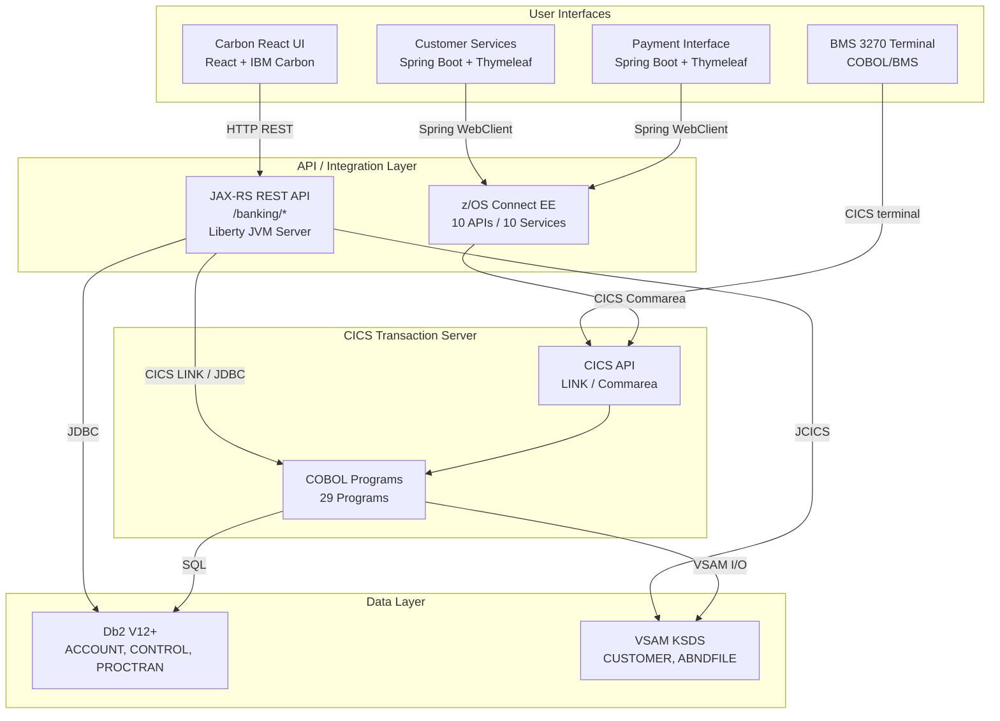
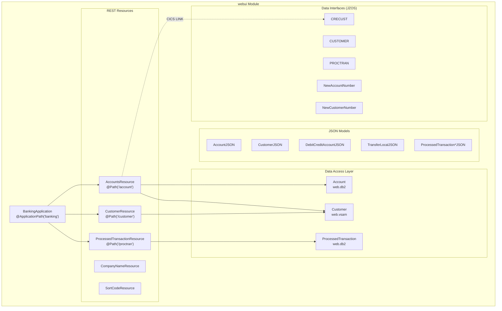
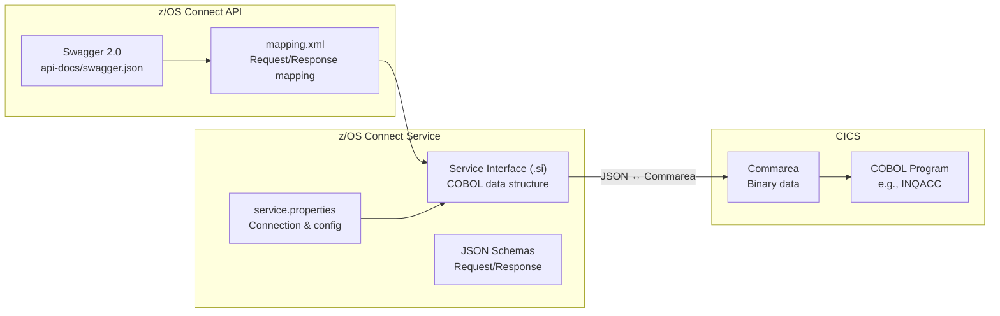
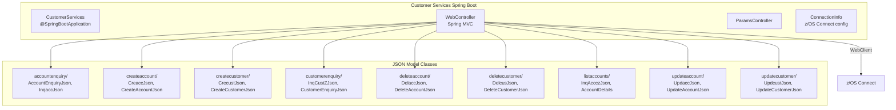
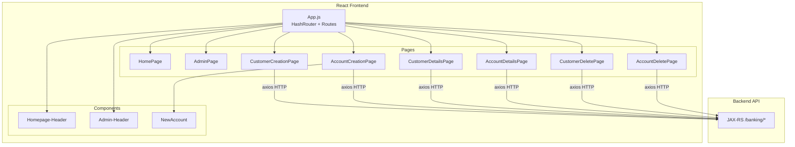
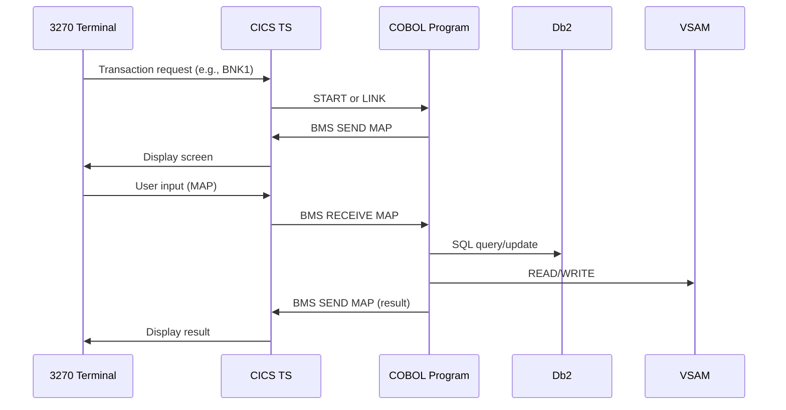
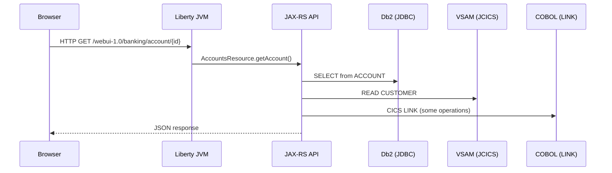
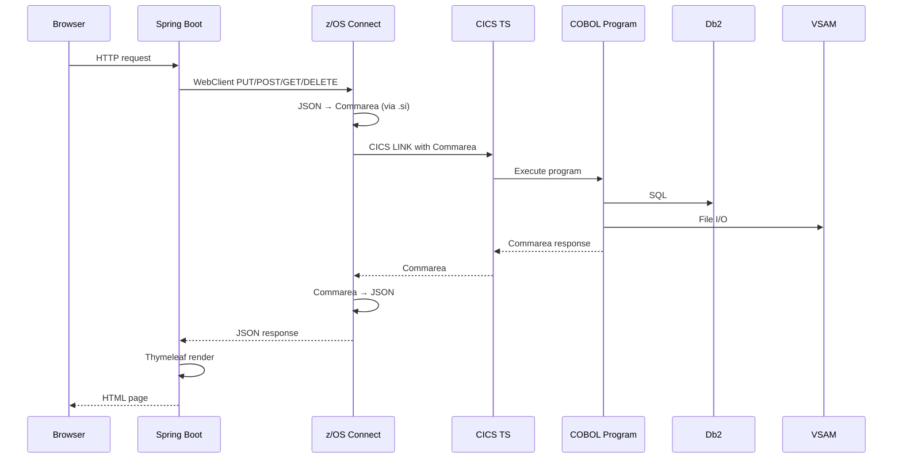
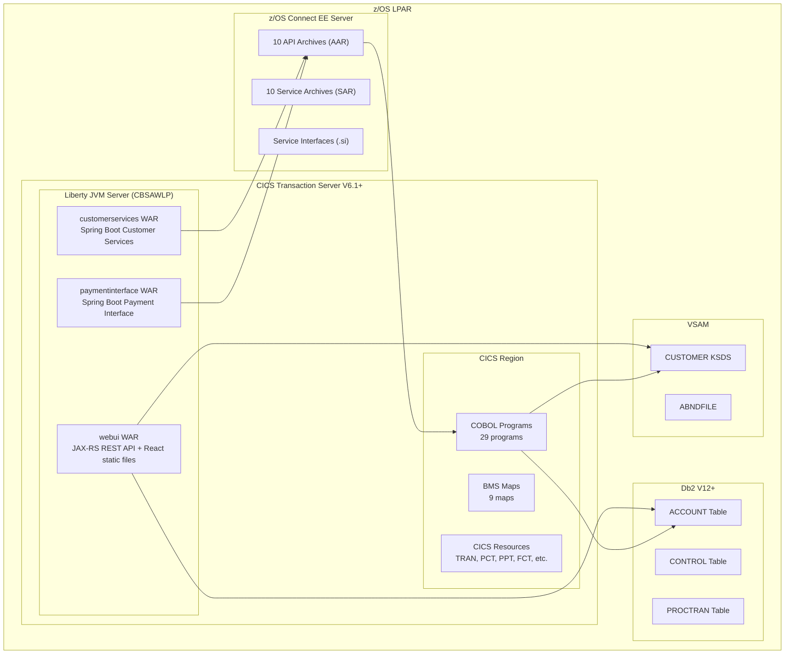

# CBSA System Architecture

## Overview

The CICS Bank Sample Application (CBSA) is a multi-layered banking application demonstrating mainframe modernization patterns. It provides four distinct user interfaces that access a shared COBOL business logic layer through different integration paths. The architecture illustrates how traditional CICS/COBOL applications can be progressively extended with modern web technologies while preserving existing business logic.



---

## Architecture Layers

### Layer 1: COBOL Business Logic (Core)

The foundation of CBSA is a set of 29 COBOL programs that implement all banking business rules. These programs run as CICS transactions and are the single source of truth for business logic.

**Source**: `src/base/cobol_src/`

| Program | Size | Purpose |
|---------|------|---------|
| `BANKDATA` | 54 KB | Bank data management utility |
| `BNK1CAC` | 44 KB | Create account (BMS) |
| `BNK1CCA` | 31 KB | Create customer (BMS) |
| `BNK1CCS` | 53 KB | Create customer (BMS extended) |
| `BNK1CRA` | 38 KB | Create account (BMS alternate) |
| `BNK1DAC` | 38 KB | Delete account (BMS) |
| `BNK1DCS` | 66 KB | Delete customer (BMS) |
| `BNK1TFN` | 40 KB | Transfer funds (BMS) |
| `BNK1UAC` | 47 KB | Update account (BMS) |
| `BNKMENU` | 43 KB | Main menu (BMS) |
| `CREACC` | 42 KB | Create account (called program) |
| `CRECUST` | 51 KB | Create customer (called program) |
| `DBCRFUN` | 28 KB | Debit/credit function |
| `DELACC` | 22 KB | Delete account (called program) |
| `DELCUS` | 25 KB | Delete customer (called program) |
| `GETCOMPY` | 1 KB | Get company name |
| `GETSCODE` | 1 KB | Get sort code |
| `INQACC` | 33 KB | Account inquiry |
| `INQACCCU` | 29 KB | Account inquiry by customer |
| `INQCUST` | 23 KB | Customer inquiry |
| `UPDACC` | 14 KB | Update account (called program) |
| `UPDCUST` | 11 KB | Update customer (called program) |
| `XFRFUN` | 67 KB | Transfer function (largest program) |
| `ABNDPROC` | 6 KB | Abnormal termination processor |
| `CRDTAGY1`-`CRDTAGY5` | 9 KB each | Credit score agencies (5 programs) |

**COBOL Copybooks** (37 files in `src/base/cobol_copy/`): Define commarea structures, data layouts, and BMS map definitions shared between programs.

**BMS Maps** (9 files in `src/base/bms_src/`):

| Map | Purpose |
|-----|---------|
| `BNK1MAI` | Main menu |
| `BNK1ACC` | Account menu |
| `BNK1CAM` | Create account menu |
| `BNK1CCM` | Create customer menu |
| `BNK1CDM` | Customer delete menu |
| `BNK1DAM` | Delete account menu |
| `BNK1DCM` | Delete customer menu |
| `BNK1TFM` | Transfer funds menu |
| `BNK1UAM` | Update account menu |

---

### Layer 2: JAX-RS REST API (WebUI Module)

The webui module provides a JAX-RS REST API running on the CICS Liberty JVM Server. It directly accesses Db2 and VSAM through JDBC and JCICS APIs, providing endpoints for the React frontend.

**Source**: `src/webui/`
**Package**: `com.ibm.cics.cip.bankliberty`
**Packaging**: WAR (deployed to Liberty JVM Server `CBSAWLP`)



**Key Classes:**

| Class | Purpose |
|-------|---------|
| `BankingApplication` | JAX-RS `@ApplicationPath("banking")` entry point |
| `AccountsResource` | CRUD for accounts (62 KB, largest class) — create, read, update, delete, debit, credit, transfer |
| `CustomerResource` | CRUD for customers (41 KB) — create, read, update, delete |
| `ProcessedTransactionResource` | Query processed transactions (15 KB) |
| `CompanyNameResource` | Get company name |
| `SortCodeResource` | Get sort code |
| `HBankDataAccess` | Base class for Db2 connection management via JNDI `jdbc/defaultCICSDataSource` |
| `CreditScore` / `CreditScoreCICS540` | Credit score calculation logic |

**Db2 Connection Pattern**: `HBankDataAccess` uses a static `HashMap` keyed by CICS task number to cache and reuse JDBC connections per task. Connections are obtained via JNDI lookup of `jdbc/defaultCICSDataSource` and use `TRANSACTION_READ_UNCOMMITTED` isolation level.

**Data Access Approach**: The webui module uses a **dual approach**:
1. **JDBC** for Db2 tables (ACCOUNT, PROCTRAN, CONTROL) — via `web.db2.Account` and `web.db2.ProcessedTransaction`
2. **JCICS** for VSAM files (CUSTOMER) — via `web.vsam.Customer`
3. **CICS LINK** for some operations — using JZOS-generated data interfaces in `datainterfaces` package

---

### Layer 3: z/OS Connect Integration Layer

z/OS Connect EE provides a standards-based REST API that fronts COBOL programs using the **CICS Commarea** pattern. This allows external clients to call COBOL programs as REST services.

**Source**: `src/zosconnect_artefacts/`

#### API Definitions (10 APIs)

Each API has a Swagger 2.0 definition and maps HTTP operations to z/OS Connect services:

| API | Method | Path | Service | COBOL Program | Description |
|-----|--------|------|---------|---------------|-------------|
| `creacc` | POST | `/insert` | CSacccre | CREACC | Create account |
| `crecust` | POST | `/insert` | CScustcre | CRECUST | Create customer |
| `inqaccz` | GET | `/enquiry/{accno}` | CSaccenq | INQACC | Account enquiry |
| `inqacccz` | GET | `/list/{custno}` | CScustacc | INQACCCU | List accounts by customer |
| `inqcustz` | GET | `/enquiry/{custno}` | CScustenq | INQCUST | Customer enquiry |
| `delacc` | DELETE | `/remove/{accno}` | CSaccdel | DELACC | Delete account |
| `delcus` | DELETE | `/remove/{custno}` | CScustdel | DELCUS | Delete customer |
| `updacc` | PUT | `/update` | CSaccupd | UPDACC | Update account |
| `updcust` | PUT | `/update` | CScustupd | UPDCUST | Update customer |
| `makepayment` | PUT | `/dbcr` | Pay | DBCRFUN | Make payment (debit/credit/transfer) |

#### Service Architecture



**Service Configuration** (example: `CSaccenq/service.properties`):
- `servicetype=cicsCommarea` — Uses CICS Commarea for data exchange
- `provider=cics` — Service provider is CICS
- `connectionRef=cicsConn` — CICS connection reference
- `executableName=INQACC` — COBOL program to invoke
- `requestSIName=INQACCZ.si` / `responseSIName=INQACCZ.si` — Service interface for request/response marshalling
- `ccsid=37` — EBCDIC code page

---

### Layer 4: Spring Boot Applications

Two Spring Boot applications provide web UIs that call the z/OS Connect APIs using Spring WebClient (reactive HTTP client).

#### Customer Services Interface

**Source**: `src/Z-OS-Connect-Customer-Services-Interface/`
**Package**: `com.ibm.cics.cip.bank.springboot.customerservices`
**Port**: 19080 | **Context Path**: `/customerservices-1.0`
**Spring Boot**: 3.5.11 | **Packaging**: WAR (via `cics-bundle-maven-plugin`, deployed to `CBSAWLP`)



The `WebController` (30.6 KB) handles all customer service operations, rendering Thymeleaf templates and calling z/OS Connect APIs. The `ConnectionInfo` class reads z/OS Connect server address from system properties `CBSA_ZOSCONN_HOST` and `CBSA_ZOSCONN_PORT`.

#### Payment Interface

**Source**: `src/Z-OS-Connect-Payment-Interface/`
**Package**: `com.ibm.cics.cip.bank.springboot.paymentinterface`
**Port**: 19080 | **Context Path**: `/paymentinterface-1.1`
**Spring Boot**: 3.5.11 | **Packaging**: WAR

A simpler application with only the `WebController` (6.8 KB) and `ParamsController` (2.9 KB), handling payment (debit/credit/transfer) operations via the z/OS Connect `makepayment` API.

---

### Layer 5: React Frontend (Carbon Design)

**Source**: `src/bank-application-frontend/`
**Framework**: React 18.2 + `@carbon/react` 1.61.0
**Routing**: `react-router-dom` 5.1.0 (HashRouter)
**Build Output**: `src/webui/WebContent/` (deployed as static assets in webui WAR)
**Homepage**: `/webui-1.0/`



**API Integration**: The React frontend uses `axios` (1.13.5) to call the JAX-RS REST API. API URLs are configured via environment variables:
- `REACT_APP_ACCOUNT_URL=/webui-1.0/banking/account`
- `REACT_APP_CUSTOMER_URL=/webui-1.0/banking/customer`

---

## Data Flow Patterns

### Pattern 1: BMS 3270 Interface (Traditional)



### Pattern 2: Carbon React UI (Modern Direct)



### Pattern 3: Customer Services / Payment (z/OS Connect)



---

## Deployment Architecture



### Maven Build Structure

```
cics-banking-sample-application (parent POM)
├── src/webui                          → webui WAR (JAX-RS)
├── src/Z-OS-Connect-Customer-Services-Interface  → customerservices WAR (Spring Boot + CICS Bundle)
└── src/Z-OS-Connect-Payment-Interface → paymentinterface WAR (Spring Boot)
```

- **Parent POM**: `com.ibm.cics.cip.bank:cics-banking-sample-application:1.0`
- **CICS BOM**: `com.ibm.cics:com.ibm.cics.ts.bom:6.1-20250812133513-PH63856`
- **Customer Services**: Uses `cics-bundle-maven-plugin:1.0.8` with `bundle-war` goal targeting `CBSAWLP` JVM server
- **Frontend**: Built separately with Yarn (`yarn build`), output copied to `src/webui/WebContent/`

---

## Key Architectural Decisions

### 1. Dual Data Access Strategy

The webui module uses **two distinct approaches** to access data:
- **JDBC for Db2**: Direct SQL access via JNDI datasource, managed per CICS task
- **JCICS for VSAM**: Programmatic access to VSAM KSDS using CICS Java API
- **CICS LINK for some operations**: Calling COBOL programs via commarea (using JZOS-generated interfaces)

This allows the REST API to bypass COBOL for simple CRUD while still leveraging COBOL for complex business logic.

### 2. z/OS Connect as Integration Gateway

The Spring Boot applications use z/OS Connect EE as a **standardized API gateway** to COBOL programs. This provides:
- **JSON/REST abstraction** over binary Commarea structures
- **Swagger/OpenAPI documentation** auto-generated from service interfaces
- **Protocol decoupling** — Spring Boot doesn't need to understand CICS Commarea format

### 3. Account vs Customer Data Split

- **Account data** → Db2 relational tables (benefits: SQL query capability, ACID transactions)
- **Customer data** → VSAM KSDS files (benefits: compatibility with existing COBOL programs, key-based access)
- This mixed storage reflects typical mainframe application evolution patterns

### 4. Shared Liberty JVM Server

All three Java web applications (webui, Customer Services, Payment Interface) deploy to the **same Liberty JVM Server** (`CBSAWLP`). This simplifies deployment but means they share:
- The same JVM resources
- Port 19080 (differentiated by context path)
- The same CICS region connection

### 5. Credit Score Agency Pattern

Five identical credit score agency programs (`CRDTAGY1`-`CRDTAGY5`, ~9 KB each) simulate external credit score providers. This demonstrates the CICS pattern of connecting to external systems and could be replaced by real API calls in a production scenario.

---

## Technology Matrix

| Layer | Technology | Version | Purpose |
|-------|-----------|---------|---------|
| Frontend UI | React | 18.2.0 | Carbon React UI |
| | IBM Carbon Design | @carbon/react 1.61.0 | UI component library |
| | react-router-dom | 5.1.0 | Client-side routing |
| | axios | 1.13.5 | HTTP client |
| Backend API | JAX-RS | Jakarta WS-RS 4.0.0 | REST endpoints (webui) |
| | Spring Boot | 3.5.11 | Web framework (CS/Pay) |
| | Spring WebClient | reactor-netty 1.2.8 | Reactive HTTP client |
| | Thymeleaf | 3.1.2 | Server-side templates |
| | Jackson | 2.21.1 | JSON serialization |
| Integration | z/OS Connect EE | — | REST-to-Commarea bridge |
| | CICS Commarea | — | Binary data exchange |
| | IBM JZOS | 4.0.0.0 | COBOL data mapping |
| Runtime | CICS TS | V6.1+ | Transaction processing |
| | Liberty JVM | — | Java application server |
| | Java | 17 | Runtime |
| Database | Db2 | V12+ | Relational data |
| | VSAM KSDS | — | Key-sequenced data |
| Core Logic | COBOL | — | Business logic |
| | BMS | — | 3270 screen maps |

---

## Source Code References

| Component | Path | Key Files |
|-----------|------|-----------|
| COBOL Programs | `src/base/cobol_src/` | `CREACC.cbl`, `DBCRFUN.cbl`, `XFRFUN.cbl`, `INQACC.cbl` |
| COBOL Copybooks | `src/base/cobol_copy/` | `CREACC.cpy`, `PROCTRAN.cpy`, `CUSTOMER.cpy`, `ACCOUNT.cpy` |
| BMS Maps | `src/base/bms_src/` | `BNK1MAI.bms`, `BNK1CAM.bms`, `BNK1TFM.bms` |
| JAX-RS API | `src/webui/src/main/java/.../api/json/` | `BankingApplication.java`, `AccountsResource.java`, `CustomerResource.java` |
| Db2 Access | `src/webui/src/main/java/.../web/db2/` | `Account.java`, `ProcessedTransaction.java` |
| VSAM Access | `src/webui/src/main/java/.../web/vsam/` | `Customer.java` |
| Customer Services | `src/Z-OS-Connect-Customer-Services-Interface/src/main/java/` | `CustomerServices.java`, `WebController.java` |
| Payment Interface | `src/Z-OS-Connect-Payment-Interface/src/main/java/` | `PaymentInterface.java`, `WebController.java` |
| z/OS Connect APIs | `src/zosconnect_artefacts/apis/` | `*/api-docs/swagger.json`, `*/package.xml` |
| z/OS Connect Services | `src/zosconnect_artefacts/services/` | `*/service.properties`, `*/service-interfaces/*.si` |
| React Frontend | `src/bank-application-frontend/src/` | `App.js`, `content/*/` |
| Architecture Docs | `doc/` | `CBSA_Architecture_guide.md` |

---

## Version History

| Version | Date | Change | Author |
|---------|------|--------|--------|
| 1.0.0 | 2026-04-15 | Initial architecture context creation | ASDM Context Builder |

---

*This context file is maintained by the Context Builder toolset. Use `/asdm-context-update` command to update when workspace changes occur.*
