# CBSA Business Scenarios

## Scenario Architecture

```mermaid
graph TB
    subgraph "User Roles"
        TELLER["Bank Teller<br/>(BMS / React UI)"]
        QB["Queue Buster Staff<br/>(Customer Services)"]
        MERCHANT["Trusted Merchant<br/>(Payment Interface)"]
        EXT["External System<br/>(REST API)"]
    end

    subgraph "Customer Management"
        C1["Create Customer"]
        C2["Inquire Customer"]
        C3["Update Customer"]
        C4["Delete Customer"]
    end

    subgraph "Account Management"
        A1["Create Account"]
        A2["Inquire Account"]
        A3["List Accounts by Customer"]
        A4["Update Account"]
        A5["Delete Account"]
    end

    subgraph "Financial Transactions"
        F1["Credit / Debit"]
        F2["Transfer"]
        F3["Merchant Payment"]
        F4["Merchant Refund"]
    end

    subgraph "Administrative"
        D1["Get Sort Code"]
        D2["Get Company Name"]
        D3["View Processed Transactions"]
        D4["Credit Check (Async)"]
    end

    TELLER --> C1 & C2 & C3 & C4 & A1 & A2 & A3 & A4 & A5 & F1 & F2 & D3
    QB --> C1 & C2 & C3 & C4 & A1 & A2 & A3 & A4 & A5 & D3
    MERCHANT --> F3 & F4
    EXT --> C1 & C2 & C3 & C4 & A1 & A2 & A3 & A4 & A5 & F1 & F2 & D3
```

### Role-Operation Matrix

| Operation | Teller (BMS/React) | Queue Buster (CS) | Merchant (Payment) | External (API) |
|-----------|:---:|:---:|:---:|:---:|
| Create Customer | ✓ | ✓ | - | ✓ |
| Inquire Customer | ✓ | ✓ | - | ✓ |
| Update Customer | ✓ | ✓ | - | ✓ |
| Delete Customer | ✓ | ✓ | - | ✓ |
| Create Account | ✓ | ✓ | - | ✓ |
| Inquire Account | ✓ | ✓ | - | ✓ |
| List Accounts by Customer | ✓ | ✓ | - | ✓ |
| Update Account | ✓ | ✓ | - | ✓ |
| Delete Account | ✓ | ✓ | - | ✓ |
| Credit/Debit | ✓ | - | - | ✓ |
| Transfer | ✓ | - | - | ✓ |
| Merchant Payment | - | - | ✓ | - |
| Merchant Refund | - | - | ✓ | - |
| View Transactions | ✓ | ✓ | - | ✓ |

> **Queue Buster restriction**: Customer Services interface cannot perform money operations (deposit/withdraw/transfer).
> **Merchant restriction**: Payment Interface only handles credit/refund; MORTGAGE and LOAN accounts reject payment debits.

---

## 1. Customer Management Scenarios

### 1.1 Create Customer

**COBOL Program**: `CRECUST.cbl` | **PROCTRAN Type**: `OCC` (branch) / `ICC` (web) | **Data Store**: VSAM CUSTOMER

**Flow**:
1. Input: title, name, address, date-of-birth
2. Validate title against allowed list: `Professor, Mr, Mrs, Miss, Ms, Dr, Drs, Lord, Sir, Lady`
3. Launch async credit check via CICS Async API (5 credit agencies `CRDTAGY1`-`CRDTAGY5`)
   - Each agency: random delay 0-3s, generates random score 1-999
   - Parent waits up to 3s, averages available results
4. Validate DOB: not future, age ≤ 150 years, valid date (via `CEEDAYS`)
5. `ENQ` on named counter `CUSTNO` for synchronization
6. Read customer control record from VSAM, increment customer number
7. Write new customer record to VSAM with generated credit score
8. Update customer control record in VSAM
9. Write PROCTRAN record (type `OCC` or `ICC`)
10. `DEQ` on named counter `CUSTNO`
11. Return customer number and credit score

**Business Rules**:
- Credit score is auto-generated (1-999), not user-provided
- Named counter `ENQ`/`DEQ` ensures unique customer numbers under concurrency
- VSAM CUSTOMER record structure: `EYECATCHER(4) | SORTCODE(6) | NUMBER(10) | NAME(60) | ADDRESS(160) | DATE-OF-BIRTH(8) | CREDIT-SCORE(3) | CS-REVIEW-DATE(8)`

### 1.2 Inquire Customer

**COBOL Program**: `INQCUST.cbl` | **Data Store**: VSAM CUSTOMER

**Flow**:
1. Input: customer number (10 digits)
2. Special case: `custno=0` → generate and return a random customer
3. Special case: `custno=9999999999` → return the last customer record in VSAM
4. Read VSAM CUSTOMER file by key
5. On `SYSIDERR`: retry up to 100 times with 3s delay between attempts (VSAM storm drain)
6. Return customer data

### 1.3 Update Customer

**COBOL Program**: `UPDCUST.cbl` | **Data Store**: VSAM CUSTOMER | **No PROCTRAN**

**Flow**:
1. Input: customer number, new name and/or new address
2. Validate title if name is being updated
3. Read VSAM CUSTOMER with UPDATE lock
4. Reject if both name and address are empty (nothing to update)
5. Rewrite customer record in VSAM
6. Return updated customer data

**Business Rules**:
- Does NOT write PROCTRAN (no audit trail for updates)
- Does NOT update date-of-birth or credit score
- Must provide at least name or address

### 1.4 Delete Customer

**COBOL Program**: `DELCUS.cbl` | **PROCTRAN Type**: `ODC` (customer) + `ODA` (each account) | **Data Store**: VSAM + Db2

**Flow**:
1. Input: customer number
2. Retrieve all accounts for the customer (via `INQACCCU` → Db2 query)
3. For each account: delete from Db2 ACCOUNT table, write PROCTRAN type `ODA`
4. Delete customer record from VSAM
5. Write PROCTRAN type `ODC`

**Business Rules**:
- Cascading delete: all accounts are deleted before the customer
- Each deleted account generates its own PROCTRAN record
- Account deletion logs the actual balance at time of deletion

---

## 2. Account Management Scenarios

### 2.1 Create Account

**COBOL Program**: `CREACC.cbl` | **PROCTRAN Type**: `OCA` (branch) / `ICA` (web) | **Data Store**: Db2 ACCOUNT

**Flow**:
1. Input: customer number, account type, interest rate, overdraft limit
2. Verify customer exists (`LINK INQCUST`)
3. Count existing accounts for customer (Db2 query)
4. Reject if customer already has ≥ 9 accounts (max 10 including new one)
5. Validate account type: `ISA, MORTGAGE, LOAN, SAVING, CURRENT`
6. `ENQ` on named counter `ACCNO`
7. Read CONTROL table for next account number, increment
8. Insert into Db2 ACCOUNT table
9. Write PROCTRAN type `OCA` or `ICA`
10. `DEQ` on named counter `ACCNO`
11. Return account number

**Db2 ACCOUNT record**: `EYE-CATCHER(4) | CUST-NO(10) | SORT-CODE(6) | NUMBER(8) | TYPE(8) | INTEREST-RATE(4V99) | OPENED(8) | OVERDRAFT-LIMIT(8) | LAST-STMT-DATE(8) | NEXT-STMT-DATE(8) | AVAILABLE-BALANCE(S9(10)V99) | ACTUAL-BALANCE(S9(10)V99)`

### 2.2 Inquire Account

**COBOL Program**: `INQACC.cbl` | **Data Store**: Db2 ACCOUNT

**Flow**:
1. Input: account number (8 digits), sort code (6 digits)
2. Special case: account number `99999999` → return the last account in Db2
3. Read Db2 ACCOUNT table by key
4. Return account data including balances

### 2.3 List Accounts by Customer

**COBOL Program**: `INQACCCU.cbl` | **Data Store**: Db2 ACCOUNT

**Flow**:
1. Input: customer number
2. Query Db2 ACCOUNT table for all accounts matching customer number
3. Return list of accounts with balances

### 2.4 Update Account

**COBOL Program**: `UPDACC.cbl` | **Data Store**: Db2 ACCOUNT | **No PROCTRAN**

**Flow**:
1. Input: account number, sort code, new account type, interest rate, overdraft limit
2. Reject if account type is spaces (blank)
3. Read Db2 ACCOUNT by key
4. Update account type, interest rate, overdraft limit
5. Write updated row to Db2
6. Return updated account data

**Business Rules**:
- Does NOT write PROCTRAN
- Does NOT update balance (use credit/debit for that)
- Does NOT update customer number or account number

### 2.5 Delete Account

**COBOL Program**: `DELACC.cbl` | **PROCTRAN Type**: `ODA` (branch) / `IDA` (web) | **Data Store**: Db2 ACCOUNT

**Flow**:
1. Input: account number, sort code
2. Read account from Db2 (to capture current balance)
3. Delete row from Db2 ACCOUNT
4. Write PROCTRAN with actual balance at time of deletion

---

## 3. Financial Transaction Scenarios

### 3.1 Credit / Debit

**COBOL Program**: `DBCRFUN.cbl` | **PROCTRAN Types**: `CRE`/`DEB` (teller), `PCR`/`PDR` (payment) | **Data Store**: Db2 ACCOUNT + PROCTRAN

**Flow**:
1. Input: account number, sort code, amount, credit/debit flag, facility type
2. Read account from Db2
3. **Debit checks**:
   - Sufficient funds: `available balance + amount ≥ 0` (overdraft allowed)
   - Payment debit (`FACILTYPE=496`): reject if account type is `MORTGAGE` or `LOAN`
4. Update `AVAILABLE-BALANCE` and `ACTUAL-BALANCE` in Db2
5. Write PROCTRAN:
   - Teller: `CRE` (credit) or `DEB` (debit)
   - Payment: `PCR` (credit) or `PDR` (debit)
6. If PROCTRAN write fails → `SYNCPOINT ROLLBACK` (entire operation rolled back)
7. Return new balances

**Business Rules**:
- Available balance and actual balance are updated identically
- Overdraft is allowed (available balance can go negative within overdraft limit)
- MORTGAGE/LOAN accounts reject payment debits but accept payment credits (refunds)
- Two-phase commit: both Db2 update and PROCTRAN write must succeed

### 3.2 Transfer

**COBOL Program**: `XFRFUN.cbl` | **PROCTRAN Type**: `TFR` (2 records) | **Data Store**: Db2 ACCOUNT + PROCTRAN

**Flow**:
1. Input: from-account, from-sort-code, to-account, to-sort-code, amount
2. Reject if amount ≤ 0
3. Read both accounts from Db2
4. Check sufficient funds on source account: `available balance - amount ≥ 0`
5. Debit source account, credit target account
6. Write 2 PROCTRAN records (both type `TFR`)
7. Handle Db2 deadlock with retry
8. Return before/after balances for both accounts

**Business Rules**:
- Transfer requires non-zero positive amount
- No overdraft allowed on source for transfers (unlike credit/debit)
- Two PROCTRAN records: one for debit side, one for credit side
- Deadlock retry: if Db2 returns SQLCODE -911 (deadlock), retry the entire operation

### 3.3 Merchant Payment (Debit)

**Interface**: Payment Interface (Spring Boot) | **COBOL**: `DBCRFUN.cbl` via z/OS Connect

**Flow**:
1. Merchant sends payment request with account, sort code, amount
2. System detects `FACILTYPE=496` (payment terminal)
3. `DBCRFUN` processes as debit with `PDR` PROCTRAN type
4. **Reject** if account type is `MORTGAGE` or `LOAN`

### 3.4 Merchant Refund (Credit)

**Interface**: Payment Interface (Spring Boot) | **COBOL**: `DBCRFUN.cbl` via z/OS Connect

**Flow**:
1. Merchant sends refund request with account, sort code, amount
2. System detects `FACILTYPE=496` (payment terminal)
3. `DBCRFUN` processes as credit with `PCR` PROCTRAN type
4. All account types accept credits (including MORTGAGE/LOAN)

---

## 4. Administrative Scenarios

### 4.1 Get Sort Code

**COBOL Program**: `GETSCODE.cbl` | **Hardcoded**: `987654` (from `SORTCODE.cpy`)

Returns the bank's sort code. Used by other programs and interfaces for data consistency.

### 4.2 Get Company Name

**COBOL Program**: `GETCOMPY.cbl` | **Hardcoded**: `CICS Bank Sample Application`

Returns the application name for display purposes.

### 4.3 View Processed Transactions

**Data Store**: Db2 PROCTRAN table

**PROCTRAN Record Structure**:
- Transaction type code (17 types)
- Account number, sort code
- Amount
- Timestamp
- Reference data

**Transaction Type Codes**:

| Code | Description | Generated By |
|------|-------------|-------------|
| `OCA` | Branch create account | CREACC (via BMS) |
| `OCC` | Branch create customer | CRECUST (via BMS) |
| `ODA` | Branch delete account | DELACC (via BMS) |
| `ODC` | Branch delete customer | DELCUS (via BMS) |
| `ICA` | Web create account | CREACC (via API) |
| `ICC` | Web create customer | CRECUST (via API) |
| `IDA` | Web delete account | DELACC (via API) |
| `IDC` | Web delete customer | DELCUS (via API) |
| `CRE` | Credit (teller) | DBCRFUN |
| `DEB` | Debit (teller) | DBCRFUN |
| `PCR` | Payment credit | DBCRFUN (FACILTYPE=496) |
| `PDR` | Payment debit | DBCRFUN (FACILTYPE=496) |
| `TFR` | Transfer | XFRFUN |
| `CHA` | Cheque acknowledge | - |
| `CHF` | Cheque failed | - |
| `CHI` | Cheque incoming | - |
| `CHO` | Cheque outgoing | - |

### 4.4 Credit Check (Async)

**COBOL Programs**: `CRDTAGY1.cbl` - `CRDTAGY5.cbl` | **CICS Feature**: Async API

**Flow**:
1. `CRECUST` launches 5 credit agency programs via CICS `START` (async)
2. Each `CRDTAGY` program:
   - Random delay 0-3 seconds (simulates external service)
   - Generates random credit score 1-999
   - Stores result in CICS container
3. Parent `CRECUST` waits up to 3 seconds for all results
4. Averages available scores (partial results allowed if timeout)
5. Stores final credit score in customer record

**Implementation Details**:
- Uses CICS channels and containers for inter-program data exchange
- Parent uses `WAIT CICS` to collect async responses
- If fewer than 5 agencies respond within 3s, averages what's available

---

## 5. Cross-Scenario Concerns

### 5.1 PROCTRAN Audit Trail

- **Written by**: CREACC, DELACC, CRECUST, DELCUS, DBCRFUN, XFRFUN
- **NOT written by**: UPDACC, UPDCUST, INQACC, INQCUST
- **Two-phase commit**: DBCRFUN rolls back Db2 changes if PROCTRAN write fails
- **Distinction**: `O`-prefix = branch operation, `I`-prefix = web/API operation, `P`-prefix = payment operation

### 5.2 Named Counter Synchronization

- **Account numbers**: `ENQ ACCNO` / `DEQ ACCNO` in CREACC
- **Customer numbers**: `ENQ CUSTNO` / `DEQ CUSTNO` in CRECUST
- Purpose: prevent duplicate numbers under concurrent access
- Pattern: ENQ → read control record → increment → write → DEQ

### 5.3 Storm Drain Handling

- `INQCUST` handles VSAM `SYSIDERR` by retrying up to 100 times with 3-second delays
- This prevents transient VSAM availability issues from causing immediate failures

### 5.4 Abend Processing

- `ABNDPROC.cbl` handles abnormal terminations
- Writes abend information to `ABNDFILE` (VSAM KSDS)
- Allows post-incident analysis of CICS abends

### 5.5 COMMAREA Communication Pattern

All COBOL programs use CICS COMMAREA (communication area) for data exchange:

| Copybook | Program | Key Fields |
|----------|---------|------------|
| `CREACC.cpy` | CREACC | customer number, account type, interest rate, overdraft limit → account number |
| `CRECUST.cpy` | CRECUST | title, name, address, DOB → customer number, credit score |
| `UPDACC.cpy` | UPDACC | account number, sort code, new type/rate/overdraft |
| `UPDCUST.cpy` | UPDCUST | customer number, new name/address |
| `DELACC.cpy` | DELACC | account number, sort code → closing balance |
| `INQACC.cpy` | INQACC | account number, sort code → full account data |
| `INQCUST.cpy` | INQCUST | customer number → full customer data |
| `PAYDBCR.cpy` | DBCRFUN | account, amount, debit/credit flag, COMM_ORIGIN (APPLID, USERID, FACILITY, FACILTYPE) |
| `XFRFUN.cpy` | XFRFUN | from/to accounts, amount → before/after balances |

### 5.6 BMS Menu Navigation

| Option | Function | Program |
|--------|----------|---------|
| 1 | Display Customer | INQCUST |
| 2 | Display Account | INQACC |
| 3 | Create Customer | CRECUST |
| 4 | Create Account | CREACC |
| 5 | Update Account | UPDACC |
| 6 | Credit/Debit | DBCRFUN |
| 7 | Transfer | XFRFUN |
| A | List Accounts by Customer | INQACCCU |
