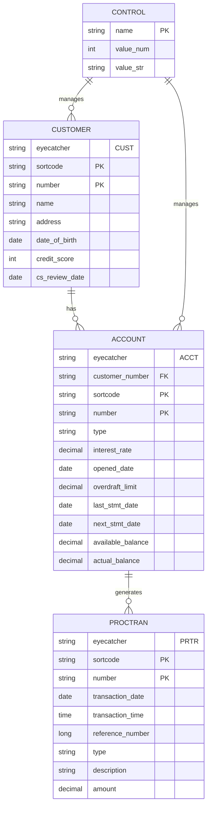

# CBSA Data Models

## Overview

This document describes the complete data model structure for the CICS Banking Sample Application (CBSA). The application uses a hybrid data storage approach with Db2 for account/transaction data and VSAM for customer data, following mainframe banking system patterns.

## Core Entity Relationships



## Core Data Entities

### 1. CUSTOMER Entity (VSAM KSDS)

**Storage**: VSAM Key Sequenced Data Set (KSDS)  
**Key Structure**: Sortcode (6) + Customer Number (10)  
**Record Length**: 259 bytes

**Fields**:
- **CUSTOMER-EYECATCHER** (4): `CUST` - Record identifier
- **CUSTOMER-KEY** (16): Composite primary key
  - CUSTOMER-SORTCODE (6): Bank sort code
  - CUSTOMER-NUMBER (10): Unique customer identifier
- **CUSTOMER-NAME** (60): Full customer name
- **CUSTOMER-ADDRESS** (160): Complete customer address
- **CUSTOMER-DATE-OF-BIRTH** (8): Birth date (YYYYMMDD format)
- **CUSTOMER-CREDIT-SCORE** (3): Numeric credit rating (000-999)
- **CUSTOMER-CS-REVIEW-DATE** (8): Next credit review date (YYYYMMDD)

### 2. ACCOUNT Entity (Db2 Table)

**Storage**: Db2 Table in ACCOUNT tablespace  
**Primary Key**: ACCOUNT-SORTCODE + ACCOUNT-NUMBER  
**Indexes**: ACCTINDX (PK), ACCTCUST (sortcode + customer number)

**Fields**:
- **ACCOUNT-EYE-CATCHER** (4): `ACCT` - Record identifier
- **ACCOUNT-CUSTOMER-NUMBER** (10): Foreign key to CUSTOMER
- **ACCOUNT-KEY** (14): Composite primary key
  - ACCOUNT-SORT-CODE (6): Bank sort code
  - ACCOUNT-NUMBER (8): Unique account number
- **ACCOUNT-TYPE** (8): Account type (ISA, MORTGAGE, LOAN, SAVING, CURRENT)
- **ACCOUNT-INTEREST-RATE** (6): Interest rate (9(4)V99 format)
- **ACCOUNT-OPENED** (8): Account opening date (YYYYMMDD)
- **ACCOUNT-OVERDRAFT-LIMIT** (8): Overdraft allowance
- **ACCOUNT-LAST-STMT-DATE** (8): Last statement date (YYYYMMDD)
- **ACCOUNT-NEXT-STMT-DATE** (8): Next statement date (YYYYMMDD)
- **ACCOUNT-AVAILABLE-BALANCE** (13): Available funds (S9(10)V99)
- **ACCOUNT-ACTUAL-BALANCE** (13): Actual balance (S9(10)V99)

### 3. PROCTRAN Entity (Db2 Table)

**Storage**: Db2 Table in PROCTRAN tablespace  
**Primary Key**: PROCTRAN-SORTCODE + PROCTRAN-NUMBER  
**Purpose**: Transaction logging and audit trail

**Fields**:
- **PROC-TRAN-EYE-CATCHER** (4): `PRTR` - Record identifier
- **PROC-TRAN-ID** (14): Composite primary key
  - PROC-TRAN-SORT-CODE (6): Bank sort code
  - PROC-TRAN-NUMBER (8): Transaction sequence number
- **PROC-TRAN-DATE** (8): Transaction date (YYYYMMDD)
- **PROC-TRAN-TIME** (6): Transaction time (HHMMSS)
- **PROC-TRAN-REF** (12): Transaction reference number
- **PROC-TRAN-TYPE** (3): Transaction type code
- **PROC-TRAN-DESC** (40): Transaction description (variable formats)
- **PROC-TRAN-AMOUNT** (13): Transaction amount (S9(10)V99)

**Transaction Types**:
- **CRE/DEB**: Credit/Debit transactions
- **TFR**: Transfer between accounts
- **CHA/CHF/CHI/CHO**: Cheque operations
- **ICA/ICC/IDA/IDC**: Web interface operations
- **OCA/OCC/ODA/ODC**: Branch operations
- **PCR/PDR**: Payment operations

### 4. CONTROL Entity (Db2 Table)

**Storage**: Db2 Table in CONTROL tablespace  
**Primary Key**: CONTROL-NAME  
**Purpose**: System control and counters

**Fields**:
- **CONTROL-NAME** (32): Control parameter name
- **CONTROL-VALUE-NUM** (4): Numeric value (integer)
- **CONTROL-VALUE-STR** (40): String value

**Key Control Records**:
- **CUSTOMER-COUNT**: Total customer count
- **CUSTOMER-LAST**: Last assigned customer number
- **ACCOUNT-COUNT**: Total account count
- **ACCOUNT-LAST**: Last assigned account number

## Data Storage Architecture

### Database Schema

#### ACCOUNT Table Structure
```sql
CREATE TABLE ACCOUNT (
    ACCOUNT_EYECATCHER CHAR(4),
    ACCOUNT_CUSTOMER_NUMBER CHAR(10),
    ACCOUNT_SORTCODE CHAR(6) NOT NULL,
    ACCOUNT_NUMBER CHAR(8) NOT NULL,
    ACCOUNT_TYPE CHAR(8),
    ACCOUNT_INTEREST_RATE DECIMAL(6,2),
    ACCOUNT_OPENED CHAR(8),
    ACCOUNT_OVERDRAFT_LIMIT DECIMAL(10,2),
    ACCOUNT_LAST_STMT_DATE CHAR(8),
    ACCOUNT_NEXT_STMT_DATE CHAR(8),
    ACCOUNT_AVAILABLE_BALANCE DECIMAL(12,2),
    ACCOUNT_ACTUAL_BALANCE DECIMAL(12,2)
)
```

#### PROCTRAN Table Structure
```sql
CREATE TABLE PROCTRAN (
    PROCTRAN_EYECATCHER CHAR(4),
    PROCTRAN_SORTCODE CHAR(6) NOT NULL,
    PROCTRAN_NUMBER CHAR(8) NOT NULL,
    PROCTRAN_DATE DATE,
    PROCTRAN_TIME CHAR(6),
    PROCTRAN_REF CHAR(12),
    PROCTRAN_TYPE CHAR(3),
    PROCTRAN_DESC CHAR(40),
    PROCTRAN_AMOUNT DECIMAL(12,2)
)
```

### VSAM File Structure

**CUSTOMER File**:
- Organization: KSDS (Key Sequenced Data Set)
- Key Length: 16 bytes (sortcode + customer number)
- Record Length: 259 bytes
- Access Method: VSAM through CICS file control

## Data Mapping and Interfaces

### COBOL Data Structures

All data structures are defined in COBOL copybooks located in `src/base/cobol_copy/`:

- **ACCOUNT.cpy**: Account record structure
- **CUSTOMER.cpy**: Customer record structure  
- **PROCTRAN.cpy**: Processed transaction structure
- **CONTROLI.cpy**: Control record structure

### Java Data Interfaces

Generated Java classes in `src/webui/src/main/java/com/ibm/cics/cip/bankliberty/datainterfaces/`:

- **CUSTOMER.java**: JZOS-generated Java interface for customer data
- **PROCTRAN.java**: JZOS-generated Java interface for transaction data
- Other program-specific data interfaces (CREACC, CRECUST, etc.)

## Business Domain Definitions

### Account Types
- **ISA**: Individual Savings Account
- **MORTGAGE**: Mortgage account
- **LOAN**: Personal/Business loan account
- **SAVING**: Savings account
- **CURRENT**: Current/checking account

### Customer Titles
- Professor, Mr, Mrs, Miss, Ms, Dr, Drs, Lord, Sir, Lady

### Transaction Categories
- **Branch Operations**: OCA, OCC, ODA, ODC (Create/Delete Account/Customer)
- **Web Operations**: ICA, ICC, IDA, IDC (Web Create/Delete)
- **Payment Operations**: PCR, PDR (Payment Credit/Debit)
- **Transfer Operations**: TFR (Account transfers)
- **Cheque Operations**: CHA, CHF, CHI, CHO (Cheque processing)

## Data Integrity and Constraints

### Primary Keys
- **CUSTOMER**: Sortcode + Customer Number (VSAM key)
- **ACCOUNT**: Sortcode + Account Number (Db2 primary key)
- **PROCTRAN**: Sortcode + Transaction Number (Db2 primary key)
- **CONTROL**: Control Name (Db2 primary key)

### Foreign Key Relationships
- **ACCOUNT.CUSTOMER-NUMBER** → **CUSTOMER.CUSTOMER-NUMBER**
- **PROCTRAN** references account through sortcode/number combination

### Data Validation
- Eye catcher values validate record integrity
- Date fields use YYYYMMDD format
- Amount fields support signed values with 2 decimal places
- Credit scores range 000-999

## Data Access Patterns

### COBOL Program Access
- Direct VSAM access for customer data
- SQL/DB2 access for account and transaction data
- CICS file control for VSAM operations

### Java/REST API Access
- JAX-RS endpoints in Liberty JVM server
- JZOS record generator for COBOL data mapping
- Spring Boot interfaces for z/OS Connect integration

### Frontend Data Models
- React components use JSON representations
- Carbon Design System for UI presentation
- REST API calls to backend services

## Data Migration and Integration

### z/OS Connect Integration
- API definitions in `src/zosconnect_artefacts/apis/`
- Service definitions in `src/zosconnect_artefacts/services/`
- Swagger documentation for REST APIs

### Spring Boot Interfaces
- Customer Services Interface: Thymeleaf templates
- Payment Interface: Transaction processing
- JSON mapping for COBOL data structures

## Performance Considerations

### Indexing Strategy
- Primary indexes on key fields for fast lookup
- Secondary indexes for customer-account relationships
- VSAM KSDS provides efficient key-based access

### Data Partitioning
- Account data in Db2 ACCOUNT tablespace
- Transaction data in Db2 PROCTRAN tablespace  
- Control data in Db2 CONTROL tablespace
- Customer data in VSAM KSDS file

## Version History
| Version | Date       | Change                   | Author               |
|---------|------------|--------------------------|----------------------|
| 1.0.0   | 2026-04-15 | Initial data model documentation | ASDM Context Builder |

---

*This data model documentation provides the complete structural overview of CBSA's data architecture. Refer to specific entity definitions for detailed field-level information.*