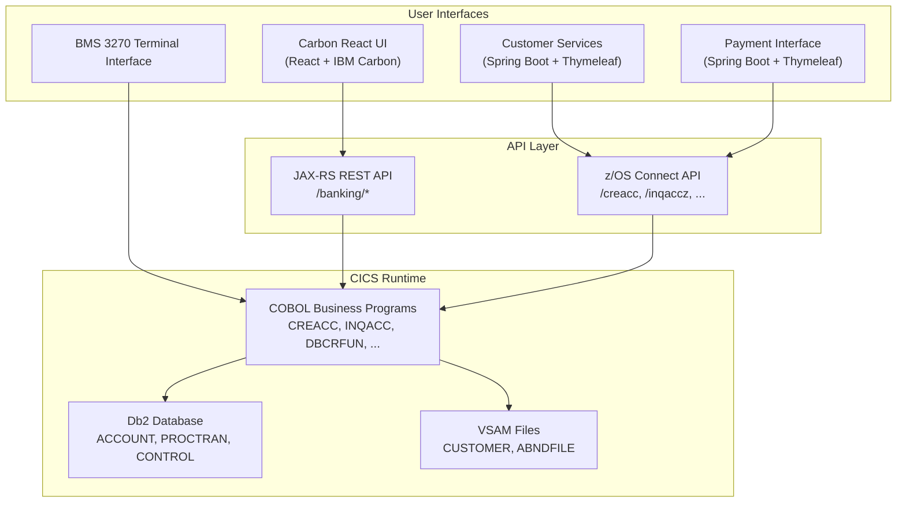

# CBSA Workspace Context Index

## Overview
This document serves as the index and guide for AI models to understand and operate within this workspace, providing a structured overview of workspace contents.

## Workspace Information

### Basic Information
- **Workspace Name**: CICS Bank Sample Application (CBSA)
- **Description**: IBM CICS banking sample application simulating bank teller operations, demonstrating integration of CICS, COBOL, BMS, Db2, SQL, Java, Liberty, Spring Boot, and z/OS Connect technologies
- **Maven Coordinates**: `com.ibm.cics.cip.bank:cics-banking-sample-application:1.0`
- **License**: Eclipse Public License - v 2.0

### Technology Stack
- **Primary Languages**: Java 17, COBOL, JavaScript (React)
- **Backend Frameworks**: Spring Boot 3.5.11, JAX-RS (Jakarta WS-RS)
- **Frontend Framework**: React 18.2 + IBM Carbon Design (@carbon/react 1.61.0)
- **Template Engine**: Thymeleaf (Customer Services and Payment interfaces)
- **Build Tools**: Maven (with Maven Wrapper), Yarn 4.10.3 (frontend)
- **Database**: Db2 V12+ (account, control, processed transaction tables), VSAM KSDS (customer file)
- **Runtime**: CICS TS V6.1+, Liberty JVM Server (CBSAWLP), z/OS Connect EE
- **JSON Processing**: Jackson 2.21.1, IBM JSON4J
- **HTTP Client**: Spring WebClient (reactive, reactor-netty)
- **COBOL Data Mapping**: IBM JZOS Record Generator / CobolDatatypeFactory
- **CICS Integration**: cics-bundle-maven-plugin 1.0.8, com.ibm.cics.server API

### Business Background
- **Business Domain**: Banking / Financial Services
- **Core Business Processes**:
  - Deposit / Withdrawal (debit / credit)
  - Inter-account transfer
  - Create / Delete accounts and customers
  - Query account and customer information
  - Update account and customer information
  - View processed transactions
- **Business Rules**:
  - Account types: ISA, MORTGAGE, LOAN, SAVING, CURRENT
  - Customer titles: Professor, Mr, Mrs, Miss, Ms, Dr, Drs, Lord, Sir, Lady
  - Credit score: Automatically generated when new customers are created
  - Transaction records: All successful banking operations are logged to the PROCTRAN table

## Workspace Structure

### File Tree and Descriptions
```
cics-banking-sample-application-cbsa/
├── .asdm/                              # ASDM configuration and toolsets
│   ├── contexts/                       # Context files (this directory)
│   ├── toolsets/                       # Installed toolsets
│   └── workspace/                      # Workspace data
│       └── features/                   # PRD Builder features
├── .codebuddy/                         # CodeBuddy command configuration
│   └── commands/                       # ASDM slash commands
├── doc/                                # Architecture documentation
│   ├── CBSA_Architecture_guide.md      # Architecture guide
│   └── images/Architecture/            # Architecture diagrams
├── etc/                                # Installation and usage documentation
│   ├── install/                        # Installation guides and JCL
│   │   ├── base/                       # COBOL base installation
│   │   │   ├── buildjcl/               # Compile JCL
│   │   │   ├── db2jcl/                 # Db2 installation JCL
│   │   │   ├── installjcl/             # CICS installation JCL
│   │   │   └── linkeditjcl/            # Link-edit JCL
│   │   ├── carbonReactUI/              # Carbon React UI installation
│   │   └── springBootUI/               # Spring Boot UI installation
│   │       ├── aarfiles/               # API archive files
│   │       ├── sarfiles/               # Service archive files
│   │       └── zosconnectserver/       # z/OS Connect server configuration
│   └── usage/                          # User guides
│       ├── base/                       # BMS user guide
│       ├── carbonReactUI/              # Carbon React UI guide
│       └── springBoot/                 # Spring Boot guide (includes RESTful API guide)
├── src/                                # Source code
│   ├── base/                           # COBOL/BMS base code
│   │   ├── bms_src/                    # BMS map definitions (.bms)
│   │   ├── cobol_copy/                 # COBOL Copybooks (.cpy)
│   │   └── cobol_src/                  # COBOL source programs (.cbl)
│   ├── webui/                          # Liberty Web UI (JAX-RS)
│   │   ├── src/main/java/             # Java source
│   │   │   └── com/ibm/cics/cip/bankliberty/
│   │   │       ├── api/json/           # REST API resource classes
│   │   │       ├── datainterfaces/     # COBOL data interfaces (JZOS generated)
│   │   │       ├── web/db2/           # Db2 data access layer
│   │   │       ├── web/vsam/          # VSAM data access layer
│   │   │       └── webui/data_access/ # WebUI data access layer
│   │   ├── WebContent/                # React frontend build output
│   │   └── pom.xml                    # webui Maven configuration
│   ├── bank-application-frontend/      # React frontend source
│   │   ├── src/                        # React components and pages
│   │   ├── public/                     # Static assets
│   │   └── package.json               # Yarn dependency configuration
│   ├── Z-OS-Connect-Customer-Services-Interface/  # Customer Services Spring Boot
│   │   └── src/main/java/             # Spring MVC controllers and JSON classes
│   ├── Z-OS-Connect-Payment-Interface/            # Payment Interface Spring Boot
│   │   └── src/main/java/             # Spring MVC controllers and JSON classes
│   └── zosconnect_artefacts/           # z/OS Connect artefacts
│       ├── apis/                       # API archives (AAR)
│       │   ├── creacc/                 # Create Account API
│       │   ├── crecust/                # Create Customer API
│       │   ├── delacc/                 # Delete Account API
│       │   ├── delcus/                 # Delete Customer API
│       │   ├── inqaccz/                # Account Inquiry API
│       │   ├── inqacccz/               # Customer Account List API
│       │   ├── inqcustz/               # Customer Inquiry API
│       │   ├── makepayment/            # Make Payment API
│       │   ├── updacc/                 # Update Account API
│       │   └── updcust/               # Update Customer API
│       └── services/                   # Service archives (SAR)
│           ├── CSacccre ~ CScustupd    # Customer Services SARs
│           └── Pay/                    # Payment Service SARs
├── pom.xml                             # Parent POM (3 modules)
├── build.sh / build.bat                # Build scripts
└── mvnw / mvnw.cmd                     # Maven Wrapper
```

### Key Directory Descriptions
- **`src/base/`**: COBOL core business logic, including BMS interface definitions and all banking operation programs
- **`src/webui/`**: JAX-RS REST API running on CICS Liberty JVM, providing `/banking/*` endpoints
- **`src/bank-application-frontend/`**: React frontend (Carbon Design), built and deployed to webui's WebContent
- **`src/Z-OS-Connect-Customer-Services-Interface/`**: Spring Boot customer services interface, calling COBOL programs via z/OS Connect
- **`src/Z-OS-Connect-Payment-Interface/`**: Spring Boot payment interface, calling COBOL programs via z/OS Connect
- **`src/zosconnect_artefacts/`**: z/OS Connect API and service definitions, including Swagger documentation and request/response schemas

## Four User Interfaces



## Development Guide

### Build and Compile
```bash
# Full build (frontend + backend)
./build.sh

# Frontend-only build
cd src/bank-application-frontend
yarn install
yarn build
./updateWebUI.sh

# Backend-only Maven build
./mvnw clean package

# Single module build
./mvnw clean package -pl src/webui
./mvnw clean package -pl src/Z-OS-Connect-Customer-Services-Interface
./mvnw clean package -pl src/Z-OS-Connect-Payment-Interface
```

### Key Configuration
- **Customer Services**: Port 19080, context path `/customerservices-1.0`
- **Payment Interface**: Port 19080, context path `/paymentinterface-1.1`
- **z/OS Connect Connection**: Configured via system properties `CBSA_ZOSCONN_HOST` and `CBSA_ZOSCONN_PORT`
- **Db2 Connection**: JNDI `jdbc/defaultCICSDataSource`
- **Frontend API URLs**: `REACT_APP_ACCOUNT_URL=/webui-1.0/banking/account`, `REACT_APP_CUSTOMER_URL=/webui-1.0/banking/customer`
- **CICS Bundle Deployment Target**: JVM Server `CBSAWLP`

### Code Quality
- **Frontend**: Prettier formatting, ESLint (react-app), Commitlint (conventional)
- **Java**: Maven Compiler `-Xlint:deprecation -Xlint:unchecked`
- **COBOL**: IBM Z Open Editor (zapp.yaml configuration)

## Context File Reference

The following context files are available in the `.asdm/contexts/` directory:

1. **[standard-project-structure.md](./standard-project-structure.md)** - Standard project structure and organization
2. **[standard-coding-style.md](./standard-coding-style.md)** - Coding standards and style guidelines
3. **[data-models.md](./data-models.md)** - Data models, relationships, and diagrams
4. **[deployment.md](./deployment.md)** - Deployment configuration and procedures
5. **[api.md](./api.md)** - API definitions, endpoints, and documentation
6. **[architecture.md](./architecture.md)** - System architecture and design decisions
7. **[business-scenarios.md](./business-scenarios.md)** - Business scenarios, flows, rules, and cross-cutting concerns

## AI Model Guide

### How to Use This Context
1. **Start with this index** to understand the workspace structure
2. **Reference specific context files** based on the task at hand
3. **Follow the development guide** for building, testing, and deploying
4. **Stay consistent** with existing patterns and conventions

### Common Tasks
- **Adding new banking features**: Review architecture and data models first
- **Modifying APIs**: Reference API documentation and update accordingly
- **Database changes**: Update data models and COBOL Copybooks
- **Deployment updates**: Follow deployment procedure documentation

### Key Considerations
- COBOL programs are the core business logic; Java layers call them via CICS LINK or z/OS Connect
- Account data is stored in Db2, customer data is stored in VSAM KSDS
- Spring Boot applications are deployed as CICS Bundles to the Liberty JVM Server
- z/OS Connect services use CICS Commarea pattern to interact with COBOL programs

## Version History
| Version | Date       | Change                   | Author               |
|---------|------------|--------------------------|----------------------|
| 1.0.0   | 2026-04-15 | Initial context creation | ASDM Context Builder |

---

*This context file is maintained by the Context Builder toolset. Use `/asdm-context-update` command to update when workspace changes occur.*
